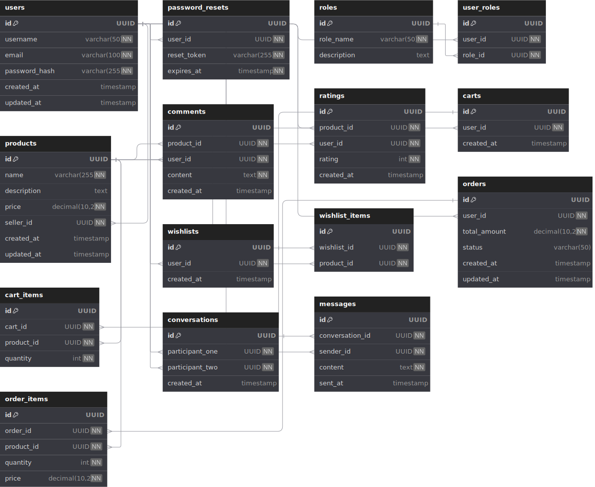

# Trust API

Trust API is part of the **Trust** software suite build base-on REST API. Trust API serves as the **main server**, built with high-performance technologies and leveraging built-in framework design patterns such as:

-   Middleware Pattern
-   Routing Pattern
-   Dependency Injection (DI)
-   Chain of Responsibility
-   Modular Pattern
-   Functional Programming Pattern

---

## Table of Contents

-   [Entity Relationship Diagram/Database Design](#entity-relationship-diagramdatabase-design)
-   [Software Architecture](#software-architecture)
-   [Tech Stack](#tech-stack)
-   [Setup Project](#setup-project)
    -   [Install Dependencies](#install-dependencies)
    -   [Setup `.env` File](#setup-env-file)
    -   [Setup Docker Compose and Dockerfile](#setup-docker-compose-and-dockerfile)
    -   [Run Docker](#run-docker)
    -   [Generate and Migrate Prisma](#generate-and-migrate-prisma)
-   [API Endpoints](#api-endpoints)
-   [License](#license)

---

## Entity Relationship Diagram/Database Design



---

## Software Architecture

Trust using Monolithic Client-Server Architecture connected each other, see the visual diagram [Lucidcart](https://lucid.app/lucidchart/b3dfe397-2b57-4cfa-ad16-3245d673ebc9/edit?viewport_loc=-1028%2C-413%2C555%2C229%2C0_0&invitationId=inv_04e3e4d3-32f0-4679-9229-493535695c3e)

---

## Tech Stack

-   **Hono**: A lightweight, high-performance web framework ideal for creating fast APIs with built-in middleware and routing.
-   **PostgreSQL**: A powerful, open-source relational database used for reliable and efficient data storage.
-   **Prisma**: An ORM (Object-Relational Mapping) tool that simplifies database management and queries in a type-safe manner.
-   **TypeScript**: A superset of JavaScript providing static typing and better tooling for large codebases.
-   **ESLint**: A code linter that helps maintain code quality and consistency by detecting and fixing problematic patterns.
-   **Prettier**: An opinionated code formatter to ensure consistent code style across the project.
-   **OpenAPI Swagger**: A tool to design and document APIs, ensuring clear and structured API specifications.
-   **Scalar**: A library for defining GraphQL scalar types, enabling custom data types for API development.

---

## Setup Project

### Install Dependencies

Run the following command to install the required dependencies:

```bash
bun install
```

### Setup .env file

Create a .env file in the root directory with the following values:

```yaml
TOKEN_SECRET=

POSTGRES_USER=
POSTGRES_PASSWORD=
POSTGRES_DB=

DATABASE_URL=
```

### Setup Docker Compose and Dockerfile

Use the configuration below for docker-compose.yml:

```yaml
services:
    backend:
        build: .
        ports:
            - "3000:3000"
        env_file:
            - path: .env.render
              required: true
        depends_on:
            - database
    database:
        image: postgres:alpine
        ports:
            - "5432:5432"
        env_file:
            - path: .env
              required: true
        command: ["postgres", "-c", "log_statement=all"]
    redis:
        image: redis
        container_name: redis
        restart: always
        ports:
            - "6380:6379"
        command: ["redis-server", "--requirepass", "my-top-secret"]
#     volumes:
#       - postgres-data:/var/lib/postgresql/data

# volumes:
#   postgres-data:
```

.dockerfile:

```yaml
# Use Bun image from the Docker Hub
FROM oven/bun:debian

# Create and change to the app directory
WORKDIR /usr/src/app

# Copy app files
COPY . .

# Install dependencies
RUN bun install --frozen-lockfile

# Generate Prisma
RUN bun run generate

# Run the application
CMD ["bun", "start"]
```

### Run docker

To start the services, run the following command:

```bash
docker-compose up -d
```

### Generate and Migrate Prisma

Run the following commands to generate the Prisma client and apply database migrations:

```bash
bun run generate
bun run db:migrate:dev
```

## API Endpoints

The following table lists the available authentication-related endpoints:

| Method | Endpoint         | Description          |
| ------ | ---------------- | -------------------- |
| POST   | `/auth/register` | Register a new user  |
| POST   | `/auth/login`    | Login to an account  |
| GET    | `/auth/me`       | Get user information |

---

## License

This project is licensed under the MIT License. See the [License](LICENSE) file for details.
